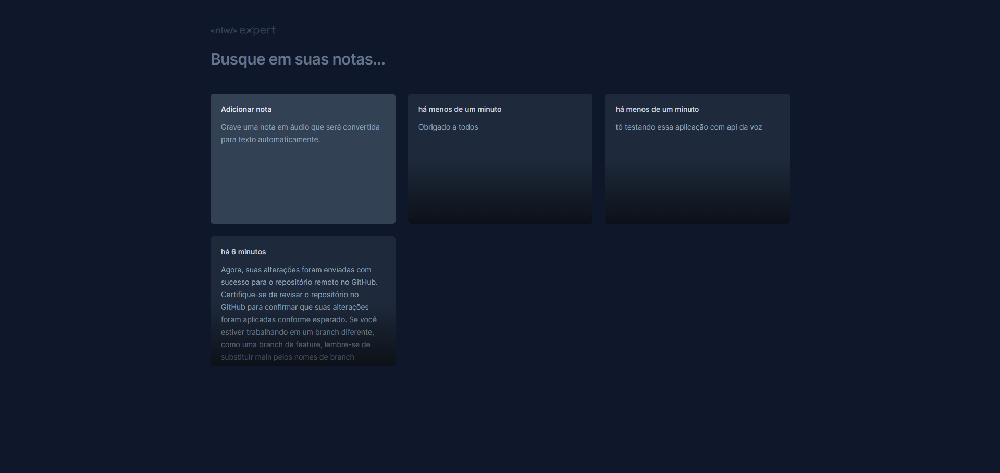

# NLW Expert (React)

Essa aplicação foi desenvolvida durante o NLW Experts da Rocketseat utilizando React, TypeScript, Tailwind e a SpeechRecognition API.

## Executando

Após clonar o repositório, acesse a pasta do projeto e execute os comandos abaixo:

```sh
npm install
npm run dev
```

Acesse http://localhost:5173 para visualizar a aplicação.
Link do deploy: https://rooberttdev.github.io/nlw-expert-notes/
